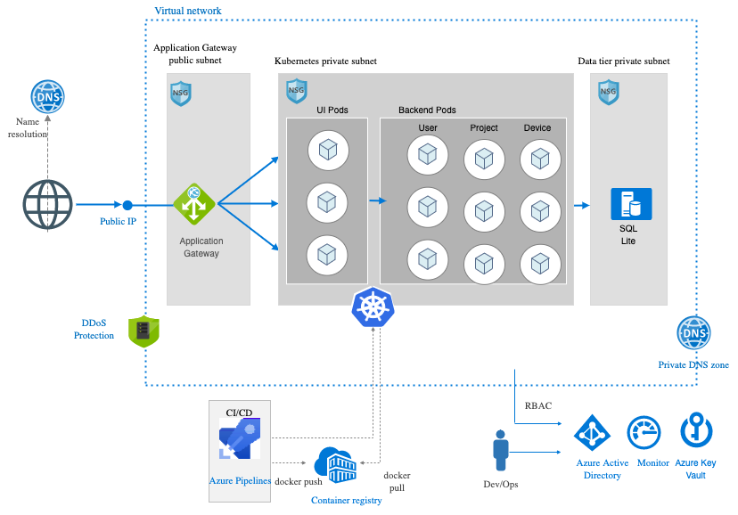

## XYZ Reality Cloud Infrastructure  



Azure resources are used to provision the services. Please find below description for resources which are used in this project.

* Azure Kubernetes Service (AKS):  To accomplish provisioning, upgrading and scaling resources on-demand,  AKS is used. It manages hosted Kubernetes environment. AKS makes it quick and easy to deploy and manage containerized applications without container orchestration expertise. All micro services are deployed to AKS under virtual network with private subnet. 
* Azure Application Gateway is a web traffic load balancer that enables you to manage traffic to your web applications, DDoS Protection, URL-based routing and more..
* Kubernetes ingress resources are used to configure the ingress rules for individual Kubernetes services. Using an ingress controller and ingress rules, a single IP address can route traffic to multiple services in a Kubernetes cluster. An ingress controller provides various features for Kubernetes services. These features include reverse proxy, configurable traffic routing, and TLS termination.
* Azure Virtual Network (VNet) is the fundamental building block for your private network in Azure. VNet enables Azure resources like Application Gateway, AKS and Database to securely communicate with each other, the internet, and on-premises networks. VNet is similar to a traditional network that you'd operate in your own data center, but brings with it additional benefits of Azure's infrastructure such as scale, availability, and isolation.
* A network security group (NSG) is a networking filter (firewall) containing a list of security rules allowing or denying network traffic to resources connected to Azure VNets.  I have setup NSG to allow inbound traffic from application gateway to the UI service and VM to VM traffic and deny all other inbound traffic. I also allow  outbound traffic to connect any VM to internet.
* Azure Key Vault is used to encrypt keys and small secrets like passwords that use keys stored in hardware security modules (HSMs). It stores jet secret JWT secret and database password.
* Public IP address is an Azure resource with its own configurable settings. It enables Inbound communication from the Internet to the Application Gateway and it routes the traffic to AKS pods.
* Container Registry is used to store Docker container images.
* Virtual Machines: Application gateway runs on a Standard_V2 VM and  AKS runs on Standard_D12_v2 VM. 

#### Prerequisites:

* **Azure subscription:** If you don't have an Azure subscription, create a [free account](https://azure.microsoft.com/free/?ref=microsoft.com&utm_source=microsoft.com&utm_medium=docs&utm_campaign=visualstudio) before you begin.

* **Install Terraform:** Follow the directions in the article, [Installing Terraform](https://learn.hashicorp.com/terraform/azure/install_az).
     * Alternately If you'd like to set up you local environment for Azure please follow the steps in the article, [Terraform and configure access to Azure](https://docs.microsoft.com/en-us/azure/terraform/terraform-install-configure)

* **Azure service principal:** change "displayName" and run below command   Take note of the values for the appId, displayName, and password.
[For detail to create an Azure service principal with Azure CLI.](https://docs.microsoft.com/en-us/cli/azure/create-an-azure-service-principal-azure-cli?view=azure-cli-latest)

```
$ az ad sp create-for-rbac --role="Contributor" --scopes="/subscriptions/SUBSCRIPTION_ID" --name <displayName>

```

* Obtain the Service Principal Object ID: Run the following command in Cloud Shell:

```
$ az ad sp list --display-name <displayName>

```

### Steps:
* Set up variables
 
  Create a file with name "terraform.tfvars" under main folder and copy and paste below variables and change it with your values
  ```
  env = "<Environment eg. Development>"

  location = "<Location of the Resource Group eg. eastus>"

  azure_subscription_id = "<Azure Subscription ID>"

  azure_sp_client_id = "<Service Principal AppId>"

  azure_sp_client_secret = "<Service Principal Client Secret/Password>"

  azure_sp_tenant_id = "<Service Principal Tenant Id>"

  azure_sp_object_id = "<Service Principal Object Id>df"

  sqlserver_admin_login = "<SQL Server adminastrator user name>"

  sqlserver_admin_password = "<SQL Server adminastrator user password>"

  ```

* Initialisation of Terraform. There two ways to keep track the terraform states. You need to decide which one to follow.

  * To keep the state locally, run below command.

    ```
    $ terraform init
    ```
  * To keep the state remote storage follow steps under "terrraform-state" folder and run below command. Replace the placeholders with appropriate values which are created when you follow the steps under "terrraform-state" folder  for your environment.

    ```

    $ terraform init -backend-config="storage_account_name=<YourAzureStorageAccountName>" -backend-config="container_name=tfstate" -backend-config="access_key=<YourStorageAccountAccessKey>" -backend-config="key=xyz-reality.terraform.tfstate"

    ```

* Change variable in terraform.tfvars with appropriate values for your environment.

* Run the terraform plan command to create the Terraform plan that defines the infrastructure elements.

```

$ terraform plan -out out.plan

```

* Run the terraform apply command to apply the plan to create the Kubernetes cluster.

```
$ terraform apply out.plan

```
### Test the Kubernetes cluster

The Kubernetes tools can be used to verify the newly created cluster.

* Get the Kubernetes configuration from the Terraform state and store it in a file that kubectl can read.
```
$ echo "$(terraform output kube_config)" > ~/.azurek8s

```
* Set an environment variable so that kubectl picks up the correct config.

```
$ export KUBECONFIG=~/.azurek8s
```

* Verify the health of the cluster.

```
$ kubectl get nodes
```

### Install Azure AD Pod Identity

* If RBAC is disabled, run the following command to install Azure AD Pod Identity to your cluster:

```
$ kubectl create -f https://raw.githubusercontent.com/Azure/aad-pod-identity/master/deploy/infra/deployment.yaml

```


### Install Helm

The code in this section uses Helm - Kubernetes package manager - to install the application-gateway-kubernetes-ingress package:

* If RBAC is disabled, run the following command to install and configure Helm:

```
$ helm init

```

* Add the AGIC Helm repository:

```
helm repo add application-gateway-kubernetes-ingress https://appgwingress.blob.core.windows.net/ingress-azure-helm-package/
helm repo update

```

### Install Ingress Controller Helm Chart

Edit the helm/helm-config.yaml and enter appropriate values for appgw and armAuth sections.

* The values are described as follows:

  * verbosityLevel: Sets the verbosity level of the AGIC logging infrastructure. See Logging Levels for possible values.
  * appgw.subscriptionId: The Azure Subscription ID for the App Gateway. Example: a123b234-a3b4-557d-b2df-a0bc12de1234
  * appgw.resourceGroup: Name of the Azure Resource Group in which App Gateway was created.
  * appgw.name: Name of the Application Gateway. Example: applicationgateway1.
  * appgw.shared: This boolean flag should be defaulted to false. Set to true should you need a Shared App Gateway.
  * kubernetes.watchNamespace: Specify the name space, which AGIC should watch. The namespace can be a single string value, or a comma-separated list of namespaces. Leaving this variable commented out, or setting it to blank or empty string results in Ingress Controller observing all accessible namespaces.
  * armAuth.type: A value of either aadPodIdentity or servicePrincipal.
  * armAuth.identityResourceID: Resource ID of the managed identity.
  * armAuth.identityClientId: The Client ID of the Identity.
  * armAuth.secretJSON: Only needed when Service Principal Secret type is chosen (when armAuth.type has been set to servicePrincipal).

* Key notes:

  * The identityResourceID value is created in the terraform script and can be found by running: echo "$(terraform output identity_resource_id)".
  * The identityClientID value is created in the terraform script and can be found by running: echo "$(terraform output identity_client_id)".
  * The <resource-group> value is the resource group of your App Gateway.
  * The <identity-name> value is the name of the created identity.
  * All identities for a given subscription can be listed using: az identity list.


* Install the Application Gateway ingress controller package:
```
helm install -f helm-config.yaml appgw-ingress-controller application-gateway-kubernetes-ingress/ingress-azure


```

Note: This application emerge from the article [Tutorial: Create an Application Gateway ingress controller in Azure Kubernetes Service](https://docs.microsoft.com/en-us/azure/terraform/terraform-create-k8s-cluster-with-aks-applicationgateway-ingress)
